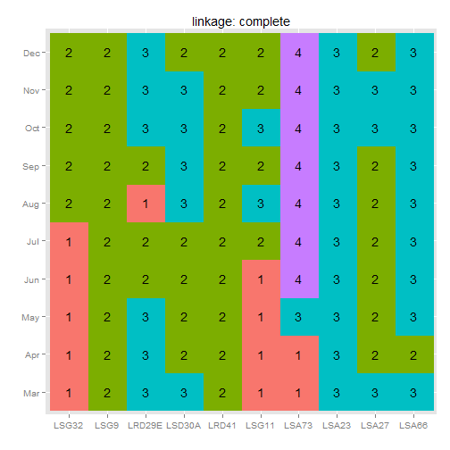
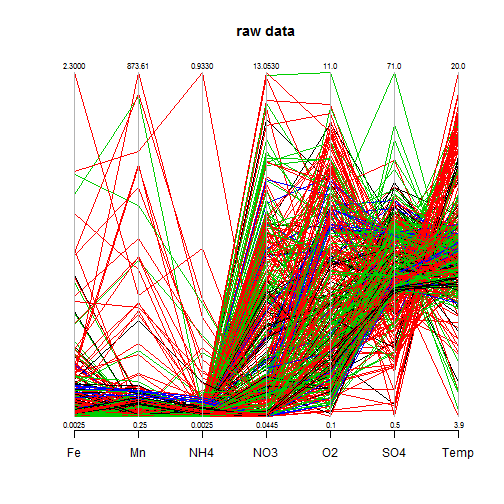
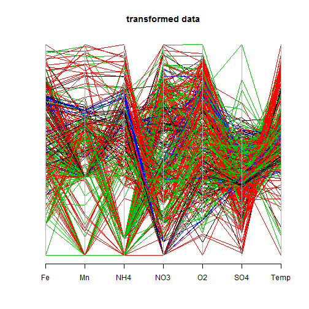
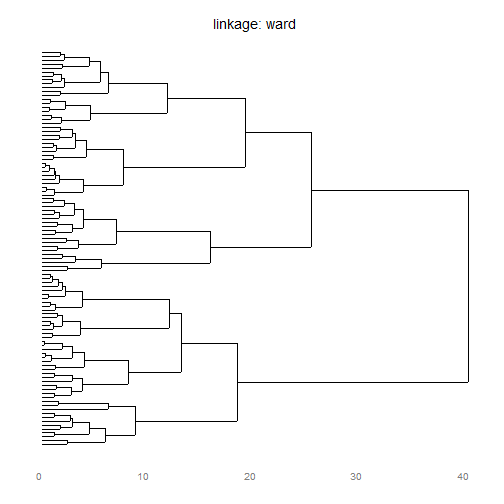
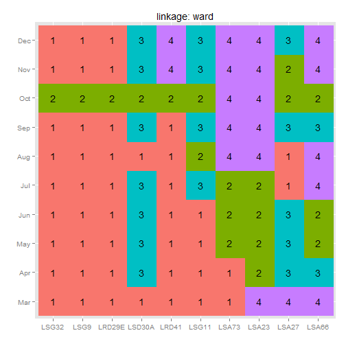
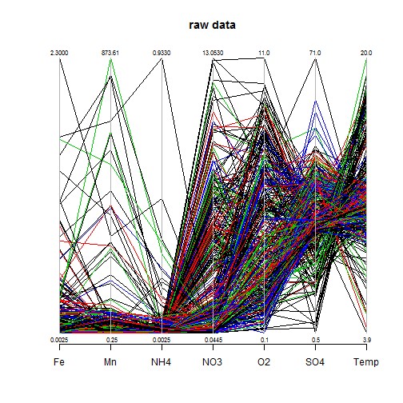
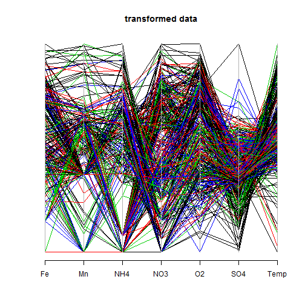
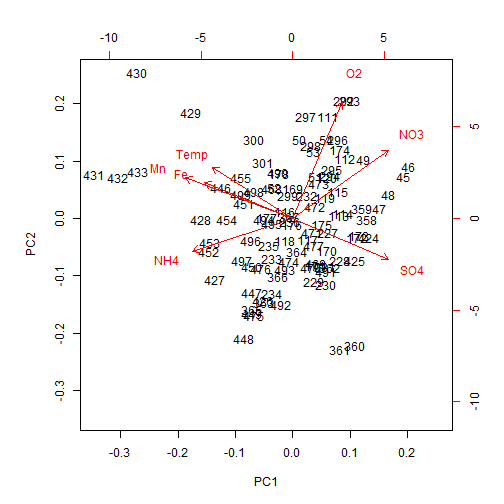

```r
library(knitr)
# opts_chunk$set(fig.path='figure/redox-')
library(reshape2)
library(lubridate)
library(ggdendro)
library(ggplot2)

# for box cox transformations
library(car)

# for parcoord() plot
library(MASS)

load("monitoring.RData")
redox <- subset(monitoring, abbrev %in% c("O2", "NO3", "Mn", "Fe", "SO4", "NH4", 
    "Temp"))

# argument must be strictly positive for transformation therefore even zero
# is bad...
redox <- within(redox, value[abbrev == "O2" & value == 0] <- NA)

wide <- na.omit(dcast(data = redox, lab + time ~ abbrev, value = "value"))


### Transformation ---- estimate the exponents of box-cox transformation
bc <- apply(wide[, -(1:2)], 2, powerTransform)
power <- sapply(bc, function(x) as.numeric(x$lambda))

# test if power transformation is necessary if 0 or 1 are within the
# confidence interval (est +/- se *1.96) see car:::summary.powerTransform
sapply(bc, function(x) testTransform(x, lambda = 1)$pval)
```

```
##      Fe      Mn     NH4     NO3      O2     SO4    Temp 
## 0.00000 0.00000 0.00000 0.00000 0.00000 0.21313 0.01139
```

```r
sapply(bc, function(x) testTransform(x, lambda = 0)$pval)
```

```
##        Fe        Mn       NH4       NO3        O2       SO4      Temp 
## 1.659e-05 7.333e-01 0.000e+00 6.950e-13 8.125e-11 0.000e+00 1.106e-06
```

```r

# transform and scale the data
trans <- bcPower(wide[, -c(1:2)], power)
trans <- apply(trans, 2, scale)

# reappend labels and restore names
trans <- data.frame(wide[, 1:2], trans)
names(trans) <- names(wide)


### Hierachical Clustering ----
tmp <- subset(trans, year(time) == 2011)

for (method in c("complete", "ward")) {
    hc <- hclust(dist(tmp), method = method)
    p <- ggdendrogram(hc, theme_dendro = TRUE, rotate = TRUE) + scale_x_continuous(labels = NULL) + 
        labs(x = "", y = "", title = paste("linkage:", method))
    
    plot(p)
    
    group <- as.factor(cutree(hc, 4))
    ct <- data.frame(month = month(tmp$time, label = T), lab = tmp$lab, group)
    
    message(method)
    dcast(ct, month ~ lab, value.var = "group")
    p <- ggplot(ct, aes(x = lab, y = month, fill = group, label = group)) + 
        geom_raster() + geom_text() + labs(x = "", y = "", title = paste("linkage:", 
        method)) + theme(legend.position = "none")
    plot(p)
    
    parcoord(wide[, -(1:2)], col = group, main = "raw data", var.label = T)
    parcoord(trans[, -(1:2)], col = group, main = "transformed data")
}
```

```
## Warning: NAs introduced by coercion
```

```
## Scale for 'x' is already present. Adding another scale for 'x', which will replace the existing scale.
## complete
```

   

```
## Warning: NAs introduced by coercion
```

```
## Scale for 'x' is already present. Adding another scale for 'x', which will replace the existing scale.
```

 

```
## ward
```

    

```r


### PCA ----
biplot(prcomp(subset(trans, year(time) == 2011)[, -(1:2)], scale = TRUE))
```

 


